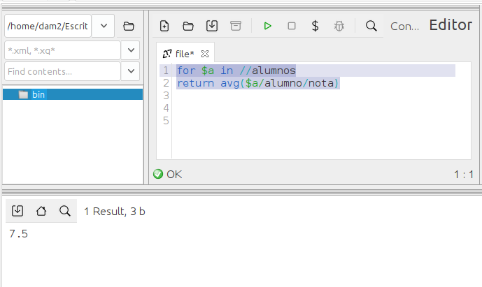

### **Ejercicio 1** : 1 p 
📌 **Muestra la nota media de los alumnos.**  
- Debes calcular la media de todas las notas de los alumnos.  
- Se aceptará la solución que use `FLWOR`.

```
avg(//nota)
```
