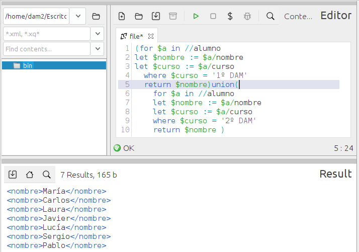
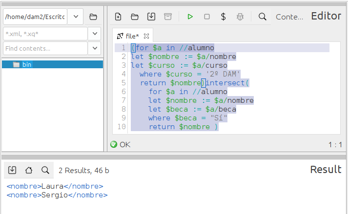

### **Ejercicio 10**: 1,5 p  
📌 Genera tres listados de alumnos utilizando expresiones de **conjuntos**: 
1. **Lista 1**: Alumnos de **1º DAM** o **2º DAM**. 0.5p  
```
(for $a in //alumno
let $nombre := $a/nombre
let $curso := $a/curso
  where $curso = '1º DAM'
  return $nombre)union(
    for $a in //alumno
    let $nombre := $a/nombre
    let $curso := $a/curso
    where $curso = '2º DAM'
    return $nombre )
```



2. **Lista 2**: Alumnos que están en **2º DAM** y que además tienen **beca**.  0.5p 
```
(for $a in //alumno
let $nombre := $a/nombre
let $curso := $a/curso
  where $curso = '2º DAM'
  return $nombre)intersect(
    for $a in //alumno
    let $nombre := $a/nombre
    let $beca := $a/beca
    where $beca = "Sí"
    return $nombre )
```



3. **Lista 3**: Alumnos de **3º DAM**, excepto aquellos que tienen **beca**.  0.5p 
```
(for $a in //alumno
let $nombre := $a/nombre
let $curso := $a/curso
  where $curso = '3º DAM'
  return $nombre)intersect(
    for $a in //alumno
    let $nombre := $a/nombre
    let $beca := $a/beca
    where $beca = "No"
    return $nombre )
```
