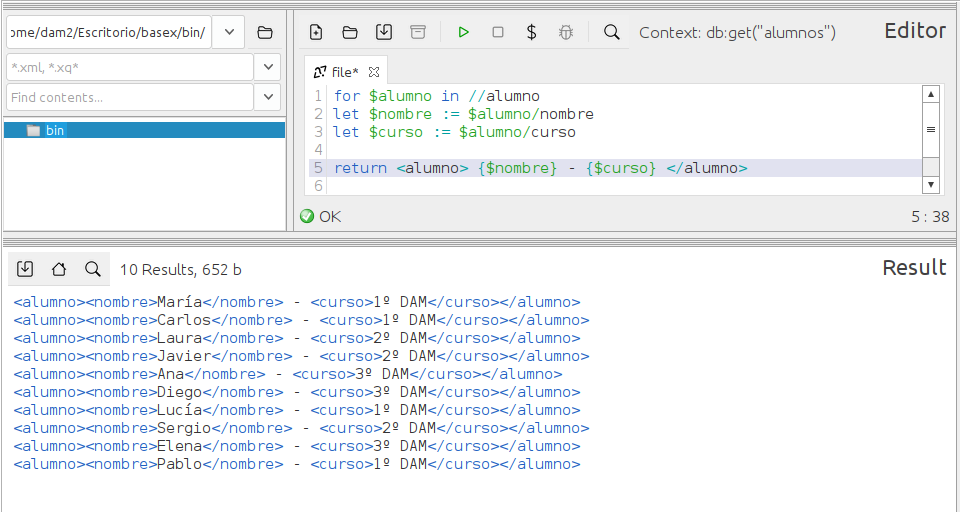

### **Ejercicio 2** : 1 p 
📌 **Muestra un listado con los nombres de cada alumno y su curso.**  
- Usa `FLWOR` para generar el listado.  0.5p
- La salida muestra un XML con `<nombre>` y `<curso>` dentro de un nodo `<alumno>`.  0.5p

```
for $alumno in //alumno
let $nombre := $alumno/nombre
let $curso := $alumno/curso

return <alumno> {$nombre} - {$curso} </alumno>
```
