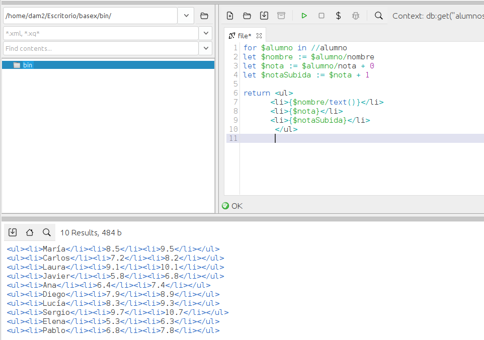

### **Ejercicio 3** : 1 p 
📌 **Genera una lista en formato HTML con el nombre de cada alumno, su "nota actual" y la "nota si le subimos un punto".**  
- La salida debe estar dentro de una lista `<ul>` en HTML. 0.5p  
- Usa `FLWOR` para construir los elementos. 0.5p  

```
for $alumno in //alumno
let $nombre := $alumno/nombre
let $nota := $alumno/nota
let $notaSubida := $nota + 1

return <ul>
      <li>{$nombre}</li>
      <li>{$nota}</li>
      <li>{$notaSubida}</li>
       </ul>
```
