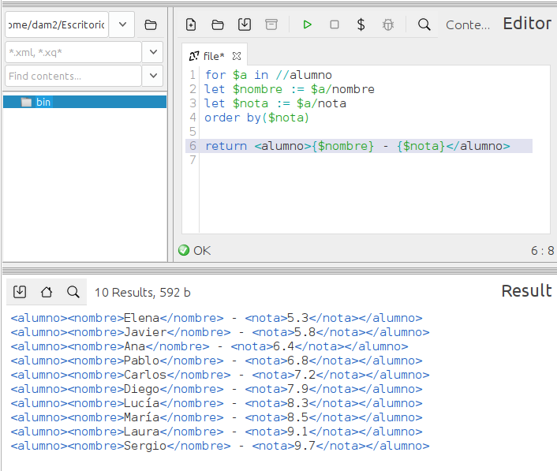

### **Ejercicio 4** : 1 p 
📌 **Muestra una lista con los alumnos ordenados por nota de menor a mayor.**  
- La salida debe ser un XML con `<nombre>` y `<nota>`. 0.5p  
- Usa `FLWOR`. 0.5p  

```
for $a in //alumno
let $nombre := $a/nombre
let $nota := $a/nota
order by($nota)

return <alumno>{$nombre} - {$nota}</alumno>
```

