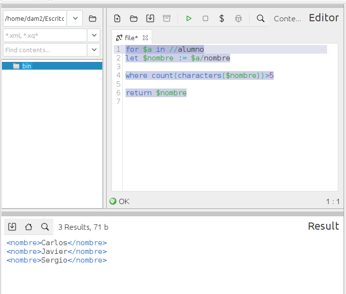

### **Ejercicio 5** : 1 p 
📌 **Devuelve una lista con los alumnos cuyo nombre tiene más de cinco letras.**  
- La salida debe ser un XML con `<nombre>`. 0.5p  
- Usa `FLWOR`. 0.5p 

```
for $a in //alumno
let $nombre := $a/nombre

where count(characters($nombre))>5

return $nombre
```


> es mejor usar string-lenth