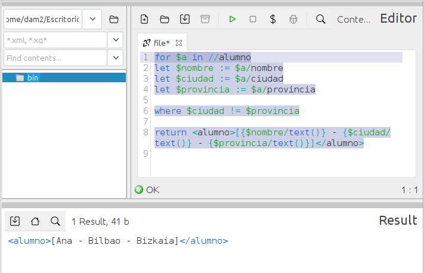

### **Ejercicio 6** : 1 p 
📌 **Devuelve una lista con los nombres, ciudad y provincia de los alumnos cuya ciudad no se llame como su provincia.**  
- Usa `FLWOR`. 0.5p  
- Usa `let` para almacenar la ciudad y la provincia en variables antes de hacer la comparación. 0.5p 

```
for $a in //alumno
let $nombre := $a/nombre
let $ciudad := $a/ciudad
let $provincia := $a/provincia

where $ciudad != $provincia

return <alumno>[{$nombre/text()} - {$ciudad/text()} - {$provincia/text()}]</alumno>
```
