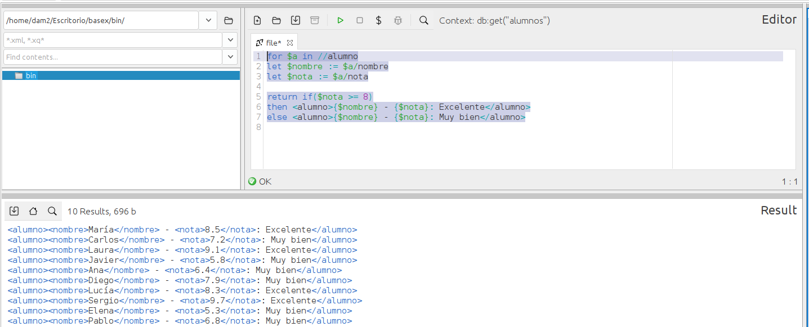

### **Ejercicio 7** : 1 p 
📌 **Crea una lista con todos los alumnos y su nota. Además, si la nota es mayor o igual a 8, añade "Excelente"; si no, añade "Muy bien".**  
- Usa `FLWOR`. 0.5p 
- listado: 0.5p   

```
for $a in //alumno
let $nombre := $a/nombre
let $nota := $a/nota + 0

return if($nota >= 8)
then <alumno>{$nombre/text()} - {$nota}: Excelente</alumno>
else <alumno>{$nombre/text()} - {$nota}: Muy bien</alumno>
```
