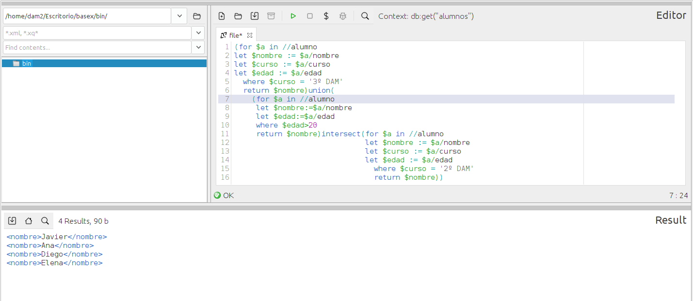

### **Ejercicio 8** : 1 p 
📌 **Genera un listado con los nombres de los alumnos que cumplen alguna de las siguientes condiciones:**  
1. **Todos** los alumnos que están en **3º DAM**.  
2. **Solo** los alumnos de **2º DAM** que tienen **más de 20 años**.  
- Usa expresiones de conjuntos. 0.5p   
- Usa `FLWOR` con `where` en lugar de condiciones en `

```
(for $a in //alumno
let $nombre := $a/nombre
let $curso := $a/curso
let $edad := $a/edad
  where $curso = '3º DAM'
  return $nombre)union(
    (for $a in //alumno
     let $nombre:=$a/nombre
     let $edad:=$a/edad
     where $edad>20
     return $nombre)intersect(for $a in //alumno
                              let $nombre := $a/nombre
                              let $curso := $a/curso
                              let $edad := $a/edad
                                where $curso = '2º DAM'
                                return $nombre))
```


> MUY BIEN, aunque los LET creo que no son necesarios