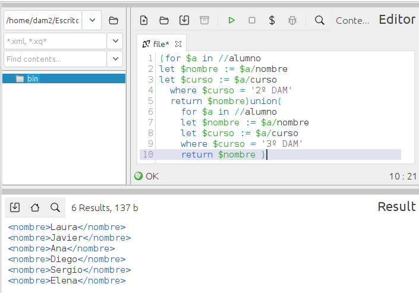

### **Ejercicio 9** : 1 p 
📌 **Devuelve una lista con los nombres de los alumnos que están en 2º DAM o 3º DAM.**  
- Usa `FLWOR`. 0.5p   
- Usa conjuntos. 0.5p 

```
(for $a in //alumno
let $nombre := $a/nombre
let $curso := $a/curso
  where $curso = '2º DAM'
  return $nombre)union(
    for $a in //alumno
    let $nombre := $a/nombre
    let $curso := $a/curso
    where $curso = '3º DAM'
    return $nombre )
```


> muy bien! Los LET siguen siendo innecesarios
